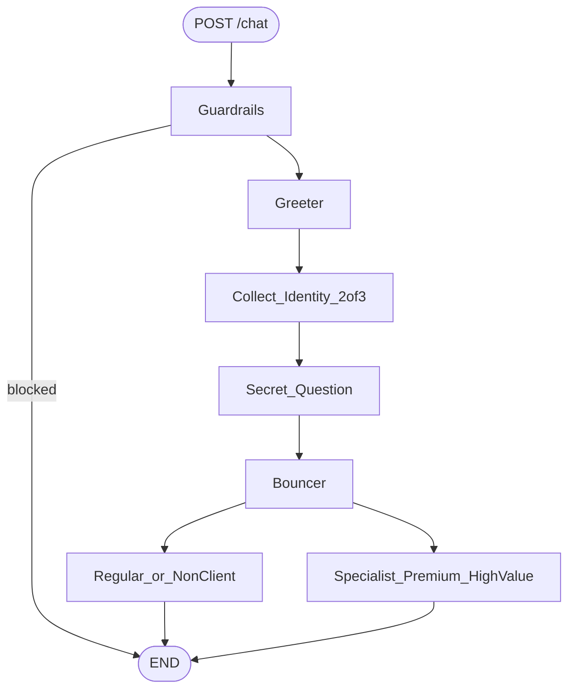

# DEUS Bank — AI Customer Support Challenge

Multi-agent bank support built with **LangGraph + FastAPI**.  
Identity checks are deterministic (2-of-3 + secret); optional OpenAI phrasing via LangChain.

## Quick start

```bash
python -m venv .venv
source .venv/bin/activate  # Windows: .venv\Scripts\activate
pip install -e ".[dev]"
cp .env.example .env
uvicorn app.main:app --reload
```

- API docs: http://127.0.0.1:8000/docs  
- Health: `GET /health`  
- Chat: `POST /chat` with `{"session_id":"demo","message":"Hello"}`

### Example conversation (premium)

```bash
curl -s -X POST localhost:8000/chat -H 'content-type: application/json' \
  -d '{"session_id":"1","message":"Hello"}'
curl -s -X POST localhost:8000/chat -H 'content-type: application/json' \
  -d '{"session_id":"1","message":"My name is Lisa phone +1122334455 IBAN DE89370400440532013000"}'
curl -s -X POST localhost:8000/chat -H 'content-type: application/json' \
  -d '{"session_id":"1","message":"Yoda"}'
```

### Tests / Docker

Prefer Docker for running the suite and the API:

```bash
# unit + API tests inside the image
docker compose --profile test run --rm --build test

# full smoke: tests + API chat flow
./scripts/docker_verify.sh

# run the API
docker compose up --build api
```

Local alternative (optional): `pip install -e ".[dev]" && LLM_MODE=mock pytest -q`

Set `LLM_MODE=openai` and `OPENAI_API_KEY` in `.env` for live LLM replies (never commit keys).

## Architecture

See [docs/architecture.md](docs/architecture.md) for the workflow diagram and agent responsibilities.



## Project layout

```
app/
  main.py              # FastAPI entrypoint
  graph/               # LangGraph state, nodes, compiled graph
  services/            # verification, guardrails, LLM, sessions
  data/bank_data.py    # sample users/accounts
docs/architecture.md
tests/
```

## Sample clients

| Name | Type | Identity (any 2 of 3) | Secret answer |
|------|------|------------------------|---------------|
| Lisa | Premium | name / `+1122334455` / `DE89370400440532013000` | Yoda |
| Marco | Regular | name / `+34911222333` / `ES9121000418450200051332` | Valencia |
| Amina | Premium | name / `+447700900123` / `GB29NWBK60161331926819` | Teal |
| Erik | Non-client (no account) | name / `+4989001122` / `DE12500105170648489890` | Rik |

---

# 🤖 AI Engineer Code Challenge

## 🎯 Business Requirements

> A customer calls the bank, hoping to get help, but instead, they get lost in an endless phone menu maze. Nightmare, right? Well, not on our watch!

Your mission is to build an **AI-powered customer support system** where multiple agents work together to identify the customer and route them to the right place—without the usual pain of endless phone menus.

Here's how the dream team of AI agents rolls:

-   **👋 Agent 1: The Greeter**  
    This is the friendly face of the bank. It starts the conversation, asks for identification, and makes sure the customer is legitimate.

-   **🛡️ Agent 2: The Bouncer**  
    Once the customer is identified, this agent steps in. It decides: are they a regular customer, a premium client, or not a customer at all?

-   **📞 Agent 3: The Specialist**  
    If the customer has a specific, high-value request (like “Help me with my yacht insurance” 🛥️), this agent ensures they get to the right expert.

-   **📜 Guardrails: The Rule Enforcer**  
    This component keeps everything safe, professional, and aligned with bank policies. No accidental million-dollar loan approvals!


## 🛠️ Technical Requirements

Here’s what you need to build and how to deliver it.

-   **🏗️ Framework & Structure**: You are free to use `LangGraph` or a similar framework. While a Jupyter Notebook is an acceptable format, remember that the overall structure and design of your solution will be a key part of the evaluation.
-   **🧠 LLM Choice**: You can use any LLM you prefer. Just remember to remove your API keys before submitting!
-   **⚙️ Core Logic**: The system must verify a customer by matching at least **two out of three** details (`name`, `phone`, `iban`) before asking their secret question.
-   **🚀 API Endpoint**: To simulate a real-world application, expose your solution via a `FastAPI` endpoint.

<br>

<details>
<summary><strong>📄 Click to see example data structures</strong></summary>

```python
# Example of user data for verification
example_of_user = {
  "name": "Lisa",
  "phone": "+1122334455",
  "iban": "DE89370400440532013000",
  "secret" : "Which is the name of my dog?",
  "answer" : "Yoda"
}
```

```python
# Example of account data to determine status
example_of_account = {
  "iban": "DE89370400440532013000",
  "premiun" : True
}
```
</details>

<br>

<details>
<summary><strong>💬 Click to see expected responses</strong></summary>

> **Note**: Your responses can be different, but be careful not to leak sensitive user data. For example, phone numbers should only be shown to verified clients.

-   **✅ Premium Client:**
    > "Thank you for reaching out regarding your account issue. As a premium client, we value your experience and are here to assist you. For immediate support, please contact our dedicated support department at +1999888999..."
-   **✅ Regular Client:**
    > "I'm sorry to hear that you're having trouble with your account. Since you're a regular client, I recommend that you call our support department at +1112112112 for assistance..."
-   **❌ Non-Client:**
    > "Thank you for reaching out. It seems that you are not currently a client of DEUS Bank. I recommend that you contact your bank's support department directly for assistance..."
</details>

## 📦 Deliverables

1.  **📈 Architecture Diagram**: A visual diagram (like the example below) illustrating your system's workflow.
2.  **💻 Working Code**: Your full implementation, including unit tests for key logic.
3.  **📄 Pull Request(s)**: Use a GitFlow-style approach to submit your features in one or more PRs.
4.  **💬 Realistic Commits**: A clean Git history with logical, well-described commits.
5.  **📤 Submission**: Please commit and push your solution directly to this repository.


---

## ✨ Bonus Points

Want to go the extra mile? Consider exploring these optional extensions:

-   **🗣️ Add a Voice Interface**: Integrate text-to-speech (TTS) and speech-to-text (STT) to give your AI a voice.
-   **🔒 Implement Advanced Guardrails**: Add more sophisticated safety mechanisms to prevent harmful, off-topic, or irrelevant responses.
-   **📚 Incorporate Conversation History**: Give your system memory to allow for more natural, context-aware conversations.
-   **🧪 Add Comprehensive Testing**: Implement a robust testing suite to ensure code quality and reliability.
-   **🚀 Implement CI/CD**: Set up a continuous integration and deployment pipeline to automate testing and releases.
-   **🐳 Dockerize the Application**: Package the solution into a Docker container for easy deployment and scalability.

Now, go forth and build the most epic AI-powered customer support ever! 🚀
