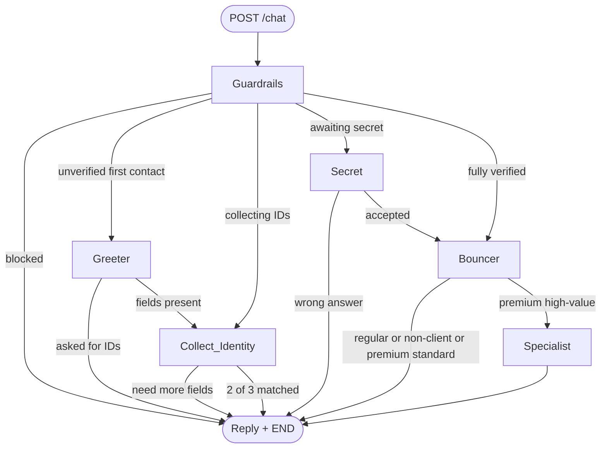

# Architecture — DEUS Bank Multi-Agent Support

## Overview

The system is a **LangGraph** state machine exposed through **FastAPI**.  
Business-critical checks (2-of-3 identity match and secret answer) are **deterministic Python**, not LLM guesses. LangChain chat models are optional for natural-language phrasing (`LLM_MODE=openai`).

## Agents

| Node | Role |
|------|------|
| **Guardrails** | Blocks policy-violating requests (loan approvals, jailbreaks, etc.) and redacts PII for unverified callers |
| **Greeter** | Welcomes the caller and starts identity collection |
| **Collect Identity** | Accumulates `name` / `phone` / `iban`, requires ≥2 matches, then asks the secret question |
| **Secret** | Validates the secret answer before any account routing |
| **Bouncer** | Classifies `premium` / `regular` / `non_client` from account records |
| **Specialist** | Routes high-value premium requests (e.g. yacht insurance) to Private Client Services |

## Workflow

## API

- `GET /health` — liveness + LLM mode
- `POST /chat` — `{ session_id, message }` → reply + phase + client_type
- `DELETE /sessions/{session_id}` — clear conversation memory

Sessions keep **conversation history** in memory for multi-turn verification and specialist keyword detection.

## Security notes

- Phone numbers / IBANs are redacted in outbound text until `fully_verified`
- Secret answers are compared case-insensitively in code
- API keys stay in environment variables (see `.env.example`)
